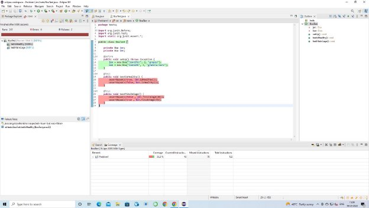

# Lab-8_202001103

**SOFTWARE ENGINEERING**

**IT-314**

**By DHRUV PRAJAPATI ID: 202001103**

**1) Create a new Eclipse project, and within the project create a package.**

**2. Create a class for a Boa. Here’s the code you can use (you may copy/paste):**

**// represents a boa constrictor**

**public class Boa {**

**private String name;**

**private int length; // the length of the boa, in feet private String favoriteFood;**

**public Boa (String name, int length, String favoriteFood){ this.name = name;**

**this.length = length;**

**this.favoriteFood = favoriteFood;**

**}**

**// returns true if this boa constrictor is healthy**

**public boolean isHealthy(){**

**return this.favoriteFood.equals("granola bars");**

**}**

**// returns true if the length of this boa constrictor is**

**// less than the given cage length**

**public boolean fitsInCage(int cageLength){ return this.length < cageLength;**

**}**

**}**

**package tests;**

**import org.junit.Before; import org.junit.Test;**

**import static org.junit.Assert.\*; public class BoaTest {**

**private Boa jen;**

**private Boa ken;**

**@Before**

**public void setUp() throws Exception {**

**jen = new Boa("Jennifer", 2, "grapes");**

**ken = new Boa("Kenneth", 3, "granola bars"); }**

**@Test**

**public void testIsHealthy() {**

**assertEquals(false, jen.isHealthy()); assertEquals(true, ken.isHealthy());**

**}**

**@Test**

**public void testFitsInCage() {**

**assertEquals(false , jen.fitsInCage(1)); assertEquals(true , ken.fitsInCage(5));**

**}**

**}**

Code for LengthInInches

**public int lengthInInches(){**

**// you need to write the body of this method int length\_to\_Inches;**

**length\_to\_Inches= 12 \* this.length;**

**return length\_to\_Inches;**

**}**

Test for lengthinInInches

**@Test**

**public void testlengthInInches() { assertEquals(24,jen.lengthInInches());**

**assertEquals(12,ken.lengthInInches());**

**}**

**THANKYOU**
